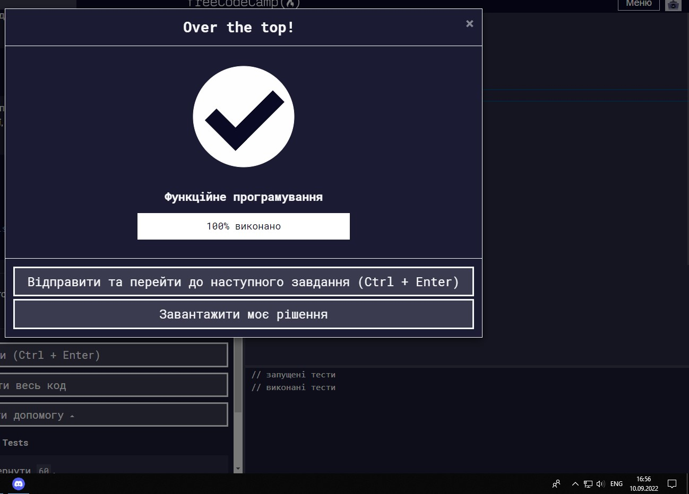

## Любий щоденнику, мені не підібрати слів.....

##### Вітаю в моєму щоденнику по Stage0!

---

## Загальні

>  Основи Git  
>  Linux CLI і мережа  
>  VCS (hello gitty), GitHub і співпраця

## Основи інтерфейсу

>  Вступ до HTML і CSS  
>  Адаптивний веб-дизайн  
>  Практика HTML і CSS  
>  Основи JavaScript  
>  Об’єктна модель документа – практика

## Розширені теми

>  Building a Tiny JS World (pre-OOP) - практика  
>  Об'єктно-орієнтований JS - практика  
>  ООП вправа – практ  
>  Офлайн веб-додатки  
>  Парна гра на пам'ять — реальний проект!  
>  Оптимізація роботи сайту  
>  Friends App - реальний проект!

# Загальні

---

## Основи Git

Октокіт з'їв мій мозок
В процессі опанування гіта я виглядала якось так   
 Дякую пану Artem Sychov за терпіння та допомогу :3

---

## Linux CLI, and HTTP

##### Linux

 

    
Шановні скріншоти

    
    
    
    

Так як досі я була не знайома з системою Linux новим для мене було все, довелось навіт вести конспект бо запам'ятати всі команди без належної практики було майже неможливо.

Тому і використовувати, напевно, буду все)

Здивував підхід до надання інформації. В процесі проходження модулів розгорнувся справжній триллер з наглядачем зоопарку в головній ролі. Це було дійсно захопливо, але на жаль так і не розкрили куди ж зник жартівник Грег. Чи може він потрапив у клітку до тигрів та його з'їли, через те що наглядач весь час зайнятий не робочими справами, ну там погані жарти для дітей надрукувати....

А ще якщо використовувати гугл перекладач можно зіштовхнутися з дуже забавними перекладами команд, наприклад оцим)

##### HTTP

  
 Так як до цього про HTTP я знала лише те що це протокол, новим було все)
Але я тепер знаю шо таке URL.
В статтях все подано дещо складно, мобуть тому що це переклад тому буду ще ознайомлюватись з цією темою окремо, щоб більш детально зрозуміти тему

## Git Collaboration

    
Шановні скріншоти

    
    
    
    

Після більш детального розбору гіта він вже не здається таким страшним як на початку.  
Здивувало те яким гнучким та зручним в командній роботі може бути гіт. Це дійсно крута штука, якщо з нею розібратись звісно)  
На шляху справжнього котана всі ці знання стануть мені в нагоді!

## Intro to HTML and CSS

    
Шановний скріншот

    
    

Оскільки я вже дещо знайома за HTML та CSS мені нарешті є що вказати в пункті про те, що ж для мене було новим.  
В HTML більш детально розібрала таблиці, раніше знала, що вони є, але не користувалась ними. Також новими для мене були різні види форм. В CSS новим для мене було те, що стиль можно надавати ще й за атрибутом, а додавання шрифтів через @font-family.  
Це базові знання тому всі вони знадобляться мені у майбутньому.

## Responsive Web Design

    
Шановні скріншоти

    
    
    

 

П'яних жабеняток з туси довела додому і розсадила по лататтям. Морква полита, будяки ліквідовано. Бабцін Gorod hero рушає далі!  
З нового те шо всі ці рядочки та колоночки в гріді можна запхати в одну властивість _grid-area_. Буду цим обов'язково користуватись у майбутньому бо це зручно.  
Здивувало те, що я, начебто, перестала плутатись у всіх цих властивостях Flexbox, і теме можу флексіть боксами разом в флексбоксом.

## HTML & CSS Practice

Запрошую вас обійняти котана))  
[Demo](https://sphericalcat.github.io/Kottans-HTML-CSS-Popup/)
[Code](https://github.com/SphericalCat/Kottans-HTML-CSS-Popup)

## JS Basics

  
Враження від цього уроку могли б виглядати як історію твоєї бабці про похід у школу, та на жаль JS з'їв мій час і треба бігти до наступних уроків(((

З нового було багато чого так як до цього я лише почала знайомитись с JS, тож відмічу лише те що мене здивувало і чим обов'язково буду користуватись у майбутньому. Це те що тернарний оператор можна використовувати для перевірки кількох умов, для мене це дійсно було несподіванкою. Все інше це те, що мій мозг працьює зовсім у іншому напрямку і це, на жаль, неможливо виправити за кілька тижнів тому попереду в мене шлях якому, навено, навіть Фродо позаздрив би.В процесі мені вже здалось шо я геть дурна і навіть умови завдання зрозуміти не можу, але в загальному чатику я побачила що не лише у мене така проблема, від цього стало трохи легше, але не надовго((

В останніх завданнях чи не постійно доводилось підглядати у відповіді бо ця купа теорії в моїй голові ніяк не хотіла складись у щось що було б схоже на рішення. Це виглядало приблизно так:

І тому щоб не марнувати час буду переходити до наступних завдань і розбиратися по ходу діла, бо знаючи себе без реальної практики я ніфіга не зрозумію і згодом все забуду.  
Амінь

    
Шановні скріншоти

    
    
    
    
    
    

Йой, далі буде....
